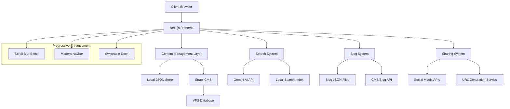

# Design Document

## Overview

This design document outlines the architecture and implementation approach for comprehensive portfolio enhancements. The solution focuses on creating a modern, performant, and maintainable system that transforms the existing Next.js portfolio into a dynamic platform with advanced UX features, content management capabilities, and intelligent search functionality.

The design leverages the existing tech stack (Next.js 15, React 19, TypeScript, Tailwind CSS) while introducing new components and systems for progressive visual effects, content management, blogging, social sharing, and AI-powered search.

## Architecture

### System Architecture Overview



### Technology Stack

**Frontend Framework:**
- Next.js 15 with App Router
- React 19 with Server Components
- TypeScript for type safety
- Tailwind CSS for styling

**Animation & Motion:**
- Framer Motion (motion/react) for smooth animations
- Vaul for swipeable sheet components
- Custom CSS animations for progressive effects

**Content Management:**
- Primary: Strapi CMS (self-hosted on VPS)
- Fallback: Local JSON files for development
- File uploads via Strapi media library

**Search & AI:**
- Google Gemini API for intelligent search
- Local search indexing for performance
- Fuse.js for fuzzy search capabilities

**State Management:**
- React Server Components for data fetching
- Local state with useState/useReducer
- Context API for global state (search, theme)

## Components and Interfaces

### 1. Progressive Blur System

**Component: `ScrollBlurOverlay`**
```typescript
interface ScrollBlurProps {
  target?: RefObject<HTMLElement>
  intensity?: number
  fadeDistance?: number
  className?: string
}

interface ScrollState {
  scrollY: number
  scrollHeight: number
  clientHeight: number
  isAtBottom: boolean
  blurOpacity: number
}
```

**Implementation Approach:**
- Uses `useScroll` hook from Framer Motion for smooth scroll tracking
- CSS backdrop-filter for blur effect with gradient mask
- Intersection Observer for performance optimization
- Responsive design with mobile-specific adjustments

### 2. Modern Navigation System

**Component: `ModernNavbar`**
```typescript
interface NavbarProps {
  searchEnabled?: boolean
  sticky?: boolean
  blurBackground?: boolean
}

interface SearchWidgetProps {
  onSearchOpen: () => void
  shortcut?: string
  placeholder?: string
}
```

**Design Features:**
- Glassmorphism design with backdrop blur
- Animated search widget with keyboard shortcut indicator
- Responsive hamburger menu for mobile
- Smooth scroll-based visibility changes
- Accessibility-compliant focus management

### 3. Content Management System

**Data Structure:**
```typescript
interface ContentData {
  personal: PersonalInfo
  projects: Project[]
  experience: Experience[]
  education: Education[]
  certifications: CertificationSection[]
  skills: Skill[]
  metadata: SiteMetadata
}

interface CMSConfig {
  provider: 'strapi' | 'local'
  apiUrl?: string
  authToken?: string
  fallbackToLocal: boolean
}
```

**CMS Integration:**
- Strapi CMS with custom content types
- RESTful API with authentication
- Image upload and media management
- Mobile-responsive admin interface
- Webhook integration for auto-deployment

### 4. Blog System Architecture

**Component: `BlogPlatform`**
```typescript
interface BlogPost {
  id: string
  title: string
  slug: string
  content: string
  excerpt: string
  featuredImage?: string
  tags: string[]
  category: string
  publishedAt: Date
  updatedAt: Date
  author: Author
  seo: SEOMetadata
}

interface BlogSystemProps {
  postsPerPage: number
  enableComments: boolean
  enableReactions: boolean
  enableSharing: boolean
}
```

**Features:**
- Card-based layout with masonry grid
- Timeline navigation with year/month filtering
- Real-time search with debounced input
- Pagination with infinite scroll option
- Comment system with moderation
- Social sharing integration
- SEO optimization with structured data
- Integration with main page to show top 5 recent posts
- Unified blog system replacing Hashnode dependency

### 5. Swipeable Sharing Dock

**Component: `SharingDock`** (Based on provided code)
```typescript
interface SharingOption {
  name: string
  icon: React.ComponentType
  action: () => void
  color?: string
}

interface SharingDockProps {
  options: SharingOption[]
  currentUrl: string
  title: string
  description: string
  transition?: Transition
}
```

**Implementation:**
- Adapts provided `DynamicScrollIslandTOC` architecture
- Custom URL generation with UTM parameters
- WhatsApp deep linking with pre-filled messages
- LinkedIn sharing with Open Graph metadata
- Native-like swipe gestures using Vaul
- Spring animations with configurable parameters

### 6. Intelligent Search System

**Component: `SmartSearch`**
```typescript
interface SearchResult {
  id: string
  title: string
  content: string
  type: 'page' | 'blog' | 'project' | 'experience'
  url: string
  relevance: number
  context: string
}

interface SearchSystemProps {
  enableAI: boolean
  geminiApiKey: string
  indexSources: string[]
  maxResults: number
}
```

**AI Integration:**
- Gemini API for contextual understanding
- Local search index for instant results
- Mathematical calculation support
- Contextual suggestions and corrections
- Keyboard navigation and shortcuts

## Data Models

### Content Management Data Models

```typescript
// Strapi Content Types
interface PersonalInfo {
  name: string
  title: string
  bio: string
  avatar: MediaFile
  location: string
  email: string
  social: SocialLink[]
  resume: MediaFile
}

interface Project {
  title: string
  description: string
  category: string
  technologies: string[]
  thumbnail: MediaFile
  liveUrl?: string
  githubUrl?: string
  featured: boolean
  order: number
}

interface Experience {
  title: string
  company: string
  type: 'full-time' | 'part-time' | 'internship' | 'contract'
  startDate: Date
  endDate?: Date
  current: boolean
  description: string
  technologies: string[]
  achievements: string[]
}
```

### Blog Data Models

```typescript
interface BlogPost {
  id: string
  title: string
  slug: string
  content: string // Markdown content
  excerpt: string
  featuredImage: MediaFile
  tags: Tag[]
  category: Category
  publishedAt: Date
  updatedAt: Date
  status: 'draft' | 'published' | 'archived'
  seo: {
    metaTitle: string
    metaDescription: string
    keywords: string[]
    ogImage: MediaFile
  }
  reactions: {
    likes: number
    loves: number
    shares: number
  }
  comments: Comment[]
}

interface Comment {
  id: string
  author: string
  email: string
  content: string
  createdAt: Date
  approved: boolean
  parentId?: string
  replies: Comment[]
}
```

### Search Index Models

```typescript
interface SearchIndex {
  id: string
  title: string
  content: string
  type: ContentType
  url: string
  keywords: string[]
  lastUpdated: Date
  metadata: Record<string, any>
}

interface AISearchContext {
  userQuery: string
  searchResults: SearchResult[]
  contextualInfo: string
  suggestions: string[]
  calculations?: string
}
```

## Error Handling

### Error Handling Strategy

**1. Content Management Errors:**
- CMS API failures: Fallback to cached local JSON
- Image loading errors: Placeholder images with retry mechanism
- Authentication errors: Redirect to login with error message

**2. Search System Errors:**
- Gemini API failures: Fallback to local search only
- Network timeouts: Show cached results with offline indicator
- Invalid queries: Provide helpful suggestions

**3. Blog System Errors:**
- CMS API failures: Show cached posts with sync indicator
- Comment submission errors: Queue for retry with user notification
- Image upload errors: Compress and retry with progress feedback
- Main page blog integration: Fallback to placeholder content if blog API fails

**4. Progressive Enhancement Errors:**
- Animation failures: Graceful degradation to static versions
- Scroll tracking errors: Disable blur effect with console warning
- Touch gesture failures: Fallback to click interactions

### Error Recovery Mechanisms

```typescript
interface ErrorBoundaryState {
  hasError: boolean
  errorType: 'network' | 'api' | 'render' | 'unknown'
  fallbackComponent: React.ComponentType
  retryFunction?: () => void
}

interface RetryConfig {
  maxAttempts: number
  backoffMultiplier: number
  retryCondition: (error: Error) => boolean
}
```

## Testing Strategy

### Testing Approach

**1. Unit Testing:**
- Component testing with React Testing Library
- Hook testing for custom hooks (useScroll, useSearch)
- Utility function testing (URL generation, data validation)
- API integration testing with mock responses

**2. Integration Testing:**
- CMS integration with test database
- Search functionality with mock AI responses
- Blog system with test data
- Sharing functionality with mock social APIs

**3. E2E Testing:**
- User journey testing with Playwright
- Mobile responsiveness testing
- Performance testing with Lighthouse
- Accessibility testing with axe-core

**4. Visual Regression Testing:**
- Component screenshot testing
- Animation testing with motion capture
- Cross-browser compatibility testing
- Mobile device testing

### Performance Testing

**Metrics to Monitor:**
- Core Web Vitals (LCP, FID, CLS)
- Search response times
- CMS API response times
- Image loading performance
- Animation frame rates

**Performance Optimization:**
- Image optimization with Next.js Image component
- Code splitting for blog and search features
- Service worker for offline functionality
- CDN integration for static assets

### Accessibility Testing

**WCAG 2.1 AA Compliance:**
- Keyboard navigation testing
- Screen reader compatibility
- Color contrast validation
- Focus management testing
- ARIA label verification

## Implementation Phases

### Phase 1: Foundation (Progressive Blur + Modern Navbar)
- Implement scroll blur overlay system
- Create modern navbar with search widget
- Set up animation system with Framer Motion
- Establish responsive design patterns

### Phase 2: Content Management System
- Set up Strapi CMS on VPS
- Create content types and API endpoints
- Implement mobile-friendly admin interface
- Build fallback system with local JSON

### Phase 3: Blog Platform
- Design blog layout and components
- Implement search and filtering
- Add comment and reaction systems
- Integrate social sharing
- Replace Hashnode integration on main page with CMS blog API
- Create unified blog data fetching system

### Phase 4: Sharing System
- Adapt provided swipeable dock code
- Implement URL generation service
- Add social media integrations
- Create mobile-optimized sharing flow

### Phase 5: Intelligent Search
- Integrate Gemini AI API
- Build local search indexing
- Implement Cmd+K interface
- Add contextual search features

### Phase 6: Testing & Optimization
- Comprehensive testing suite
- Performance optimization
- Accessibility compliance
- Mobile experience refinement

This design provides a comprehensive foundation for implementing all the required portfolio enhancements while maintaining performance, accessibility, and user experience standards.